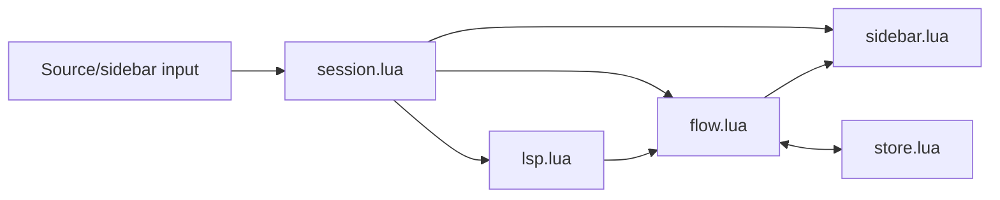

# Voyager Navigation Flow Design

- **Status:** Draft for implementation approval
- **Date:** 2026-08-01
- **Target:** Neovim 0.12.4, Lua, `nui.nvim`

## Summary

Voyager is a project-local code exploration notebook for Neovim. Opening it starts a new, unsaved flow at the current symbol and shows that flow in a small right-side popup. While the session is active, Voyager installs no mappings at all: it passively observes the editor's own LSP traffic through the `LspRequest` autocmd, and whenever the user's navigation sends a supported method from the edited buffer it records every normalizable final destination of its own read-only request as a branch in the flow. The user-visible LSP behavior is never altered.

The user can revisit any earlier location, run another LSP action, annotate important locations, explicitly save the flow as JSON, and later load a saved flow from a picker. Closing Voyager removes its popup, autocmds, and requests. Intentional navigation performed during the session remains in the user's buffers, cursor history, jumplist, and result lists.

## Context and problem

The current prototype proves the basic idea but models navigation as a linear location stack and reserves a two-column editor layout. It also issues call-hierarchy requests without the required prepare step, changes source-buffer mappings without a robust ownership boundary, and has async paths that can leave stale UI state behind. The tests and documentation still describe the original plugin template.

The finished first release needs one coherent mental model: an exploration is a persistent branching tree, and the sidebar is a view over that tree. Voyager must cooperate with the editor rather than taking it over.

## Goals

- Show a compact, non-modal flow tree beside the user's existing editor layout.
- Record definition, declaration, references, implementation, type-definition, incoming-call, and outgoing-call navigation observed while a session is active, however the user triggers it.
- Preserve every normalizable final navigation destination, including alternatives the user did not initially select; call hierarchy preserves every result for the recorded prepared item.
- Let users return to an earlier node and extend a different branch without losing prior work.
- Attach editable free-text notes to individual location nodes.
- Save and merge flows explicitly in project-local, human-readable JSON files.
- Remove Voyager-owned windows, autocmds, and request state idempotently on close; Voyager never installs or restores user mappings.
- Ship with deterministic tests, accurate help, and release metadata.

## Non-goals

- Supporting Neovim versions older than the current target, 0.12.4.
- Globally replacing or monkey-patching `vim.lsp.buf.*`.
- Attributing an observed request to a specific mapping or plugin; any pending request for a supported method from the currently edited, eligible buffer is treated as navigation and recorded.
- Autosave, cloud sync, or cross-project flow storage.
- Coordinating simultaneous writes to the same flow from multiple Neovim processes; sequential saves always merge the latest document, while a true same-instant race is last-rename-wins.
- Persisting a non-file LSP URI that cannot provide source text through an existing buffer or `storage.resolve_uri` at capture time.
- Automatically relocating stale nodes after source files move or change.
- A full-screen graph editor or arbitrary user-created edges.

## Product behavior

### Starting and ending a session

`:VoyagerOpen` creates a new unsaved flow rooted at the cursor's current source location. The internal identity symbol is the word under the cursor or `<anonymous>` when empty; the user-facing flow/root name is that word or `<filename>:<one-based line>` for the anonymous case. The command opens a right-side popup without changing the user's split layout or taking focus from the source window. `:VoyagerFocus` moves focus to it. Calling `:VoyagerOpen` again while Voyager is active also focuses the existing sidebar and does not replace the current flow.

The initial root-only flow is not considered modified. Dirty means any persisted value changed: a new action or result, refreshed display metadata, a note edit or clear, a collapse toggle, or a different current node. A no-op note submission, an identical already-known result, selecting the already-current node, and repeating an existing empty result do not mark the flow dirty. Closing or replacing a dirty flow prompts to save, discard, or cancel. An untouched root-only flow closes without a prompt. If save from that prompt fails, the flow remains open and dirty.

`:VoyagerClose`, `q`, and `<Esc>` close the session. Lifecycle is a serialized state machine: `active`, `deciding`, `saving`, `closing`, then `closed`. The first close/load intent entering `deciding` wins; later lifecycle requests are ignored with an informational notification until that transition resolves, so they cannot replace its callback or open another prompt. Close is idempotent: it cancels the session generation, removes session autocmds, and closes only Voyager-owned windows. `VimLeavePre` performs teardown without a prompt or autosave; the explicit-save policy means an unsaved in-memory flow is discarded when Neovim itself exits.

### Exploring code

Voyager records these actions while active, whichever mapping, picker, or command triggers them:

| Action | LSP method |
| --- | --- |
| Definition | `textDocument/definition` |
| Declaration | `textDocument/declaration` |
| References | `textDocument/references` |
| Implementations | `textDocument/implementation` |
| Type definition | `textDocument/typeDefinition` |
| Incoming calls | `callHierarchy/incomingCalls` |
| Outgoing calls | `callHierarchy/outgoingCalls` |

Running an action from a source location creates or updates an action group below that location. The group shows every unique returned destination. Voyager never presents LSP results and never intercepts the trigger: the user's own mapping, Neovim's built-in `gr*` defaults, or a picker plugin performs the visible navigation while Voyager records concurrently. When the user then lands exactly on a returned destination in a normal source window, Voyager marks the matching location as current. Selecting a location in the sidebar also jumps there and makes it current.

Before attaching an action, Voyager compares both the source locator and cursor with the current location. A non-empty range is start-inclusive/end-exclusive; a zero-width range matches only exact start equality. A matching cursor uses the current node. Otherwise Voyager stages a synthetic `manual jump` action directly below the current node and a location for the actual cursor, then uses that staged location as the LSP origin. The connector and LSP action commit together only on successful completion, including an empty success; failure, unsupported methods, or supersession discard both. Ordinary cursor movement is never recorded. This keeps the active branch unambiguous even when the same physical location also appears elsewhere in the tree.

A staged manual origin carries a current-claim token. If that claim still owns current when the action commits, the manual location becomes current at commit time; a later cursor landing on one of the recorded destinations then overrides it. Empty results leave the manual location current. A newer action or explicit current-node change invalidates the claim, so an older completion may add its branch but never move current.

Retracing a route backwards never grows the tree. A committed destination whose location identity matches an ancestor location on the origin's own path (including the origin itself) maps to that existing node instead of creating a new branch; the nearest matching ancestor wins. An action whose results all map to ancestors commits nothing — no action node, no dirty state — and a staged manual jump onto an ancestor re-roots the action at that ancestor without recording a connector. The destination claim carries these ancestor mappings, so landing on a retraced destination moves the current marker back up the existing path.

The user may select any earlier location and continue exploring from it. Existing action groups and destinations stay in place, so revisiting an ancestor creates a sibling path instead of replacing the old path.

### Sidebar interaction

The default popup is a NUI floating window with its own `nofile` scratch buffer, relative to the editor, anchored to the configured edge, and leaves the source window visible underneath. Voyager never mounts a user buffer into its UI or changes source buffer options, split sizes, `modifiable`, or `readonly`. The popup fits its rendered content: each render measures the projected lines and resizes the float, so a small flow occupies a small card instead of a full column. Content is capped by the configured maximum width (42 by default) and the available editor height between the tabline and command line, with a minimum footprint that keeps the header readable. Maximum width, side, border, and icons are configurable. The envelope requires at least 24 columns and 4 available rows; initial mount is atomic and creates no session if that check fails. If `VimResized` makes an active popup invalid, Voyager unmounts it under the remount guard but keeps the session; a later valid resize remounts it without taking focus. Every Open/Focus/TabEnter/cancel remount revalidates geometry; while still invalid it notifies and keeps the session hidden rather than focusing or mounting a bad window. Otherwise width is capped so at least two source columns remain. LSP completion rerenders the popup but never steals focus from the source window.

There is one process-wide session and one popup window. The project root remains the root captured at open or load. On `TabEnter`, Voyager remounts the popup in the active tab without changing source focus. A `popup_remounting` guard distinguishes that owned close from an external `WinClosed`, so tab changes do not end the session. Closing a source window merely clears that focus candidate.

An external close of the popup enters the normal dirty-flow decision in the current source window. Save or discard ends the session; cancel or failed save remounts the popup. Every Voyager-initiated jump or load first uses the most recently used valid eligible window, then any valid non-floating normal window in the current tab. If neither exists, it warns and changes no window or cursor instead of creating a split; a loaded flow still keeps its saved logical current marker. On final close, Voyager focuses a valid destination only when focus was inside a Voyager popup or prompt; otherwise the user's current window remains active. Voyager never rewinds intentional buffer, cursor, jumplist, tagstack, quickfix, or location-list changes.

Default sidebar mappings are:

| Key | Behavior |
| --- | --- |
| `<CR>` | Jump from a location/note row, or toggle an action row |
| `n` | Add, edit, or remove the selected location's note |
| `s` | Save or merge the active flow |
| `L` | Pick and load a saved project flow |
| `za` | Collapse or expand the selected action subtree |
| `q`, `<Esc>` | Close Voyager |

Rows render in call-flow order: a location's caller-producing action groups (references and incoming calls) appear above its row, recursively, and every other group appears below it, so a projected flow reads top-down from outermost callers to the deepest reached code. Location rows show symbol, one-based line, and a project-relative path, compact absolute path, or URI as appropriate. The current location has a distinct marker. Action rows show a disclosure marker, a per-method icon, a human label, and a result count, for example `implementations (3)`. Icons default to Nerd Font glyphs from the classic Font Awesome range; `sidebar.icons = false` switches to plain-text markers and a table merges per-icon overrides. A collapsed action containing the current node carries a descendant-current marker. A note appears on a second indented row with a pencil marker and is truncated to the popup width. Empty-result actions remain visible as `references (0)`. Stale locations remain visible with a stale marker.

`n` calls `vim.ui.input` with the existing note prefilled. Notes are stored as one trimmed UTF-8 line; CR/LF runs from a custom input provider become one space. A non-empty normalized response replaces the note, while an empty one removes it. Cancelling input leaves the note unchanged. The callback captures the session generation, flow ID, node ID, and a note-input token; close, load, or a newer input invalidates it so a late provider callback cannot edit a replaced flow.

Every rendered row has a kind and owner ID. A note row delegates `<CR>` and `n` to its location. `<CR>` on an action and `za` on an action toggle that subtree; `za` or `n` on an inapplicable row gives a concise informational notification and does not mutate the flow. After rerender, selection stays on the same owner ID; if collapse hides it, selection moves to the action row that hid it. Save, load, and close work from every row.

## Architecture

The rewrite separates session ownership, the domain model, LSP adaptation, rendering, and persistence:



### `session.lua`

Owns the single active session: flow, current node, dirty state, request generation, popup lifecycle, autocmd group, source buffers, the LspRequest observer, and the destination claim. It is the only module allowed to start or close a session. Repeated open, load replacement, focus transfer, late callbacks, and idempotent teardown are resolved here.

### `flow.lua`

Defines and mutates the in-memory tree. It creates location and action nodes, inserts normalized results, deduplicates siblings, tracks the current node, edits notes, controls collapsed state, and recursively merges saved and in-memory trees. It has no Neovim window or filesystem dependencies.

### `lsp.lua`

Defines the action registry and adapters. Standard location actions snapshot supporting clients and use each native `vim.lsp.Client:request` API so Voyager receives raw results/errors independently and can finalize a hung-client deadline without losing completed responses. The adapters only record; presentation belongs to the delegated key behavior. Call hierarchy uses the protocol's required two-stage request. This module normalizes client responses into Voyager locations and reports request success, partial failure, empty success, timeout, or total failure to the session.

### `sidebar.lua`

Owns one NUI popup, renders ordered rows, and maintains the rendered-line-to-node mapping. It handles only sidebar-local keys and delegates mutations to the session. Rendering preserves the selected logical node where possible.

### `store.lua`

Finds the project root, validates schemas, encodes and decodes JSON, performs recursive merge, writes atomically, scans saved flows, and provides display metadata for the load picker. It does not own UI; the session uses `vim.ui.select` for choosing a flow.

## Flow model

The tree alternates between location nodes and action nodes:

```text
location: main()
└─ action: implementations (2)
   ├─ location: MysqlStore.save()
   │  └─ action: references (3)
   │     └─ location: AuthService.login()
   └─ location: MemoryStore.save()
```

A root or manual-origin range is the maximal `iskeyword` word containing the cursor, expressed as zero-based UTF-8 byte bounds; when the cursor is not on a word, it is a zero-width range at the cursor. LSP destinations use the normalized server range. Root persistence stores `<anonymous>` as its identity symbol but renders the flow/root name fallback defined above. Other non-call-hierarchy locations store and render the word at the normalized start position, falling back to `<filename>:<one-based line>`.

A location node contains:

- collision-resistant node ID stable within the flow;
- normalized locator and canonical UTF-8 range;
- display symbol and optional source-line context;
- optional note;
- ordered action children;
- stale flag calculated when loading or opening the node.

An action node contains:

- collision-resistant node ID stable within the flow;
- canonical method and display label, including the internal `voyager/manual` connector;
- collapsed state;
- ordered result locations.

A locator is one of `{ kind = "project", path = <relative path> }`, `{ kind = "absolute", path = <absolute path> }`, or `{ kind = "uri", uri = <non-file URI> }`. File URIs use `vim.uv.fs_realpath` when the target exists and otherwise `vim.fs.normalize`; paths inside the real project root become relative project locators and all others become absolute locators. Project and absolute paths use normalized `/` separators in memory and JSON. Its collision-free locator key is the whitespace-free canonical JSON tuple `[kind, path_or_uri]`. This tagged representation is used consistently for identity, display, jumps, persistence, and stale checks.

For a project or absolute locator, an exact valid loaded buffer with that path is authoritative, including a named buffer whose file has not yet been written; otherwise Voyager reads the file from disk. The location is stale when neither source exists or the canonical range is outside the authoritative source's current line/byte bounds. This same loaded-buffer-first rule applies after restart, so a named unsaved root is navigable while that buffer exists and becomes stale after it disappears unless its file is written. A non-file response is normalizable only when an already-loaded valid buffer has that exact URI as its name or `storage.resolve_uri(uri)` returns a valid loaded buffer, because offset-encoding conversion requires its source line. Invalid live items are omitted with one summarized normalization warning. A non-empty client response with no valid item is a normalization failure, not an empty success; if every client is in that state, neither the LSP action nor a staged manual connector is committed. A truly empty successful response remains the only path that creates a zero-destination action. After restart an unresolved URI node, or a resolved URI whose range is outside the loaded buffer, is stale and non-navigable. Opening it retries resolution and bounds checking, clearing its transient stale flag on success. Voyager does not persist or guess the originating LSP client.

Node IDs use `loc-` for a node whose canonical `kind` is `location` and `action-` for one whose canonical `kind` is `action`, followed by the first 32 hexadecimal characters of `sha256(flow_id .. NUL .. nonce_hex .. NUL .. kind .. NUL .. decimal_counter)`. The hash input uses the full canonical kind string, not its display prefix. Production obtains a 128-bit nonce synchronously from `vim.uv.random(16)` and refuses to create the session if entropy acquisition fails; the nonce source is injectable for deterministic tests. IDs stay stable for the lifetime of an active flow and across its saves.

At a given location, one action group exists per canonical method. Repeating the action merges new results into that group. Results are unique within their action group by locator key plus selection-range start and end positions. Matching result nodes recursively merge their action children. The same destination reached beneath a different ancestor remains a distinct tree node because it represents a different exploration path; only a destination already on the origin's own ancestor path is folded back onto the existing node, because that is the same path travelled in reverse.

The flow root locator resolves the project root and file with `vim.uv.fs_realpath` when possible, then stores the file relative to that root. The root symbol is the trimmed result of `vim.fn.expand("<cword>")`, or `<anonymous>` when empty. `root_key` is the full SHA-256 of the whitespace-free canonical JSON tuple `[locator.kind, locator.path_or_uri, root_symbol, root.location.range.start.line, root.location.range.start.character]`. These are the canonical word-range start coordinates, not the cursor's possibly different column inside that word, and they are persisted in the root node. Fixed array positions and JSON escaping make the identity collision-free with respect to delimiters in paths, URIs, and Unicode symbols while remaining portable between clones of the project.

There is exactly one logical saved flow per root identity; another exploration from that root merges into it. Voyager derives the filename slug from the user-facing flow name. It maps ASCII `A-Z` to `a-z`, retains only ASCII `a-z0-9`, replaces every other codepoint run with one `-`, trims edge hyphens, truncates to 48 ASCII characters, and falls back to `anonymous`; it is followed by the first eight characters of `root_key`. `flow_id` is the same filename stem without `.json`. Loading recomputes the user-facing name from the root locator, symbol, and range, then verifies the persisted `name`, `root_key`, `flow_id`, and filename stem against those values. If an eight-character prefix collision names a document with a different root key, Voyager extends both the new filename and flow ID to sixteen characters and then, if necessary, the full hash. A moved root may therefore appear as an older, stale flow; semantic relocation is deliberately outside this release.

## LSP integration

### Passive request observation

Voyager does not patch global APIs and installs no mappings. Eligible source buffers are listed normal file buffers that are either under the session project root or correspond to a location already present in the active flow. This permits continued exploration into an external dependency reached through LSP without observing unrelated projects. Voyager-owned, terminal, prompt, and other special buffers are excluded.

A session-scoped `LspRequest` autocmd watches every request any client sends. A `pending` event for a supported navigation method triggers recording when the request's buffer is the current buffer, the current window is eligible, and the event was not produced by Voyager itself. Because Neovim dispatches every Voyager-originated `client:request` synchronously inside the shared request-group stage, a recording-depth counter incremented around that stage cleanly separates Voyager's own traffic — including asynchronous call-hierarchy follow-ups — from the user's. Native multi-client functions send one request per client in the same tick, so a per-action suppression flag cleared on the next scheduler tick coalesces those duplicates into one logical recording. The observed event supplies only the method and buffer; the recording captures its origin from the current cursor, which is where the user's own navigation was just invoked.

The recording adapter captures the current source location and current flow node ID as the request origin. It snapshots supporting clients and sends one `client:request` per client with position parameters generated from the captured window and that client's `offset_encoding`. References alone add `{ includeDeclaration = true }`. Async callbacks retain IDs, never Lua node-table references, and resolve them against the active flow at mutation time. Recording failures are reported and never affect the user's in-flight navigation.

Voyager cannot use the high-level functions' `on_list` option as its capture mechanism: in Neovim 0.12.4 that callback replaces the default jump/list behavior, is not invoked for an empty aggregate result, and does not expose per-client errors. Owning native per-client callbacks is therefore required for the approved empty, partial-error, timeout, and total-error behavior, and it keeps the recording request fully separate from the user's presentation.

### Normalization

The adapter accepts singleton or list responses from one or more clients. Both `Location` and `LocationLink` are converted to one structure. For `LocationLink`, `targetSelectionRange` is the navigation and deduplication range, falling back to `targetRange`; for `Location`, `range` is used. Each responding client's range is converted from its `offset_encoding` to canonical zero-based UTF-8 byte positions before deduplication or persistence. Conversion reads an exact loaded target buffer first so unsaved text matches the server snapshot, then falls back to the filesystem adapter for an unloaded file without creating a listed buffer. Non-file URIs use the resolver rule above; an unresolved item is an invalid/omitted item for that client's otherwise successful response. A destination buffer is created or loaded only when the user jumps. Jumping can then use Neovim byte columns safely, while new requests still generate positions in the target client's encoding.

Multi-client responses are processed by client name then client ID, preserving each server's result order. Voyager keeps two views: presentation items retain every normalized raw location, including duplicates, while flow locations deduplicate by locator key and canonical selection range. Each presentation item maps to its deduplicated flow node ID and feeds the destination claim; tree counts remain unique destination counts.

If at least one client succeeds, valid results are recorded and protocol, timeout, or normalization failures produce one summarized notification. A client returning a truly empty result still counts as success. If all clients fail normalization/protocol/timeout or no client supports the method, the tree is not mutated.

### Call hierarchy

Incoming and outgoing calls use a custom adapter because the native call-hierarchy functions do not expose a capture callback. The adapter mirrors Neovim's two-stage, same-client flow:

1. sends `textDocument/prepareCallHierarchy` at the origin;
2. continues directly when exactly one `CallHierarchyItem` exists, and silently selects the first prepared item when several exist, because recording must not add UI on top of the delegated key behavior;
3. sends `callHierarchy/incomingCalls` or `callHierarchy/outgoingCalls` to the same client for the selected item;
4. converts incoming `fromRanges` using `call.from.uri` and outgoing `fromRanges` using the selected prepared item's origin URI, labelling them with `call.from.name` or `call.to.name` respectively;
5. records the complete deduplicated follow-up result without presenting anything.

The adapter retains `(client_id, item, response_index)` through selection so client-specific item data is returned only to its originating client. A successful prepare or follow-up with no locations creates the visible zero-result action. Unsupported prepare or follow-up methods notify the user and do not create an action group.

The prepared-item selector remains an injectable seam with `vim.ui.select` semantics; production wires the non-interactive first-item selector, and interaction-ownership tokens still let an older superseded action finalize without mutation.

### Destination tracking

Each logical action receives a monotonically increasing request token. Because presentation is delegated, Voyager cannot observe which list row or picker entry the user activated; the only universal signal is where the cursor actually lands. When the newest action commits at least one destination, the session arms a destination claim holding the generation, flow ID, request token, and each committed destination's buffer-or-path plus exact start position. On every `CursorMoved` in an eligible normal source window, a cursor sitting exactly on a claimed destination's start makes that node current. The claim stays armed after a match, so stepping through the same result set—`:cnext` in the native quickfix, repeated picker jumps, or any other navigation—keeps updating current until a newer action arms a new claim, an explicit sidebar selection supersedes it, or the flow is replaced or closed.

An exact-position match on the newest action's own destinations is deliberately weaker attribution than list-row observation, and it is the honest trade for never owning presentation: landing on a recorded destination of the action the user just ran is treated as choosing it. Explicitly selecting a node in the sidebar drops the claim so a later coincidental landing cannot override the user's stated choice.

Logical actions may overlap and every non-superseded valid response is recorded beneath its captured origin. The newest-started action alone owns destination tracking; an older action completing later updates the tree silently and never arms a claim. Any older recorded result remains navigable from the sidebar.

### Async safety

Every logical action captures the active session generation and snapshots its supporting clients. An exactly-once aggregator owns each request ID and a `navigation.timeout_ms` deadline for each network stage; waiting for a prepare-item choice has no network deadline, and the follow-up starts a fresh one. On a deadline it cancels unfinished clients, finalizes from responses already received, classifies the missing clients as timed out, and ignores their eventual callbacks. Closing or replacing a flow best-effort cancels every request, closes every deadline timer, and increments the generation.

Dispatch uses a barrier because an in-process Neovim client may invoke its callback before `client:request` returns. The adapter creates every client slot, starts logical status/deadline ownership, and sets `dispatching` before the first call. A synchronous callback may settle its slot but cannot finalize while the barrier is set. A false/nil dispatch result settles setup failure; a returned request ID attaches only if that slot is still pending. Releasing the barrier after the final dispatch performs the first possible aggregate finalization.

Every asynchronous LSP, note-input, flow-picker, and dirty-decision callback validates its generation, flow/interaction token, and referenced IDs before acting. Load and close invalidate all outstanding interaction tokens. A late callback may only perform provider-local cleanup; it cannot change the flow, focus, mappings, or Voyager UI.

The sidebar header owns request status; there is no separate spinner window. A request counter supports overlapping requests, and the exactly-once finalizer decrements it for success, empty success, error, timeout, cancellation, supersession, and setup failure. Successful empty requests create a visible zero-result action. Failed or superseded requests do not mutate the tree. Notifications include the action label and a concise reason.

## Persistence

### Location and naming

Each project stores one JSON document per saved flow under:

```text
<project-root>/.voyager/flows/<safe-flow-name>-<root-hash>.json
```

`.voyager/flows` is the fixed schema-v1 storage location, not a configurable path.

The project root is selected from the origin buffer. Voyager first chooses the deepest attached-LSP `root_dir` that contains the origin file, then the nearest `.git` ancestor found with `vim.fs.root`, then the current working directory if it contains the file, and finally the file's parent directory. Real paths are compared when available. This rule is fixed for the session even when navigation enters a nested or external file. `.voyager/` is intentionally project-local and may be version controlled.

### Schema

The initial persisted format is versioned and nested to remain readable:

```json
{
  "schema_version": 1,
  "position_encoding": "utf-8",
  "revision": 3,
  "flow_id": "authorize-d70ea46c",
  "name": "authorize",
  "root_key": "d70ea46c382e0db859f48f1d97a83658e86c8751baad3d0830ef8f04b461cccf",
  "created_at": "2026-08-01T18:25:43Z",
  "updated_at": "2026-08-01T18:41:02Z",
  "current_node_id": "loc-6f2e8c4a91d07b33c4e8a90fd6a01752",
  "root": {
    "id": "loc-6f2e8c4a91d07b33c4e8a90fd6a01752",
    "kind": "location",
    "location": {
      "locator": { "kind": "project", "path": "lua/auth.lua" },
      "range": {
        "start": { "line": 42, "character": 0 },
        "end": { "line": 42, "character": 9 }
      },
      "symbol": "authorize",
      "context": "local function authorize(user)"
    },
    "note": "important for auth",
    "actions": [
      {
        "id": "action-4ab5980f3c2689961cdb764ea8142b61",
        "kind": "action",
        "method": "textDocument/implementation",
        "label": "implementations",
        "collapsed": false,
        "results": []
      }
    ]
  }
}
```

Positions are zero-based UTF-8 byte positions. Project file URIs are reconstructed from the loaded project root, absolute files use their normalized path, and non-file schemes use the locator's `uri`. Timestamps are UTC RFC 3339 strings at second precision from the injected clock, and revision is a positive integer. `current_node_id` must resolve to a location node. `stale` and transient mutation flags are not persisted; stale state is recalculated when a document is loaded.

JSON is canonical and version-control friendly: two-space indentation, the known schema key order illustrated above, array order preserved, LF line endings, and one final newline. Optional `context` and `note` fields are omitted when absent; `null` is not a valid substitute. Schema-v1 validation rejects unknown object keys rather than silently preserving or dropping them. The reader accepts insignificant whitespace and key order, but a successful save rewrites the canonical form.

### Save and merge

Saving is explicit through `s` or `:VoyagerSave`. The session keeps the revision loaded at open/last save plus a transient journal for note, display-metadata, collapse, and current-node mutations. A newly created flow treats its initial root metadata and current node as touched for merge precedence without making the root-only flow dirty; creating a non-root result marks its symbol and any non-empty context as touched; and a loaded flow starts with no touched fields. Save re-reads and validates the latest on-disk revision immediately before recursively merging, so sequential writers always merge the newest completed save. If no file exists for the root key, Voyager creates revision 1.

- action groups merge by canonical method beneath the same location;
- result locations merge by locator key and selection range;
- new branches are appended in active exploration order;
- saved-only branches remain;
- locators, ranges, and the root symbol are immutable identity fields; a touched active non-root `symbol` or any touched non-empty `context` refreshes matched display metadata, while untouched metadata preserves the latest saved value;
- action labels are derived from the canonical method registry on load/render/save, so the persisted `label` is readable but not authoritative;
- flow `name` follows the root's user-facing naming rule (including the anonymous filename-and-line fallback), `flow_id` is derived from that name and `root_key`, and the latest valid disk document supplies the original `created_at`;
- a touched note, including an explicit clear, overrides the latest saved value while an untouched active note preserves it;
- touched collapsed states and current node override the latest saved view state, while untouched values preserve it;
- matching nodes retain the active tree's IDs so sidebar selections, result-list tags, and in-flight request origins remain valid; saved-only IDs are imported unless they collide, in which case they and any saved references are remapped;
- `created_at` is preserved, `revision` increments from the latest disk value, and `updated_at` changes only after a successful write.

Production merge, encode, synchronous filesystem write/flush/rename, and active-tree replacement run without yielding inside one Neovim main-loop callback while lifecycle state is `saving`; no LSP, input, or picker callback can interleave with that snapshot. The canonical JSON goes to a uniquely named sibling temporary file, is flushed and closed, then atomically renamed over the destination. On success, the merged tree replaces the active tree, its revision becomes the new base, the mutation journal clears, and the session becomes clean. Because active IDs are retained and async work resolves IDs against the current tree, save is safe while requests or a destination claim are pending; callbacks that run after save return create a new mutation epoch and mark the flow dirty again. A failed validation, encode, write, or rename removes its temporary file, leaves the prior document untouched, and restores the pre-save dirty state. Simultaneous cross-process writes remain subject to the stated last-rename-wins non-goal.

### Loading

`L` or `:VoyagerLoad` scans `.voyager/flows/*.json`, validates each supported document and its filename/root hash, and opens `vim.ui.select` with the persisted user-facing flow `name`, relative path, and update time, sorted by update time descending and then name/path ascending. Invalid JSON and unsupported newer schemas are reported and skipped. They are never overwritten automatically. An empty directory gives one informational notification; cancelling the picker changes nothing. Its callback uses a cancellable session token.

Loading replaces the current flow only after the dirty-flow prompt succeeds. It jumps the most recently used source window to the saved current node. If that node is stale, Voyager makes the root logically and visually current, jumps there when valid, and marks the flow dirty with a current-node repair so the next explicit save fixes the document. Missing files and out-of-range positions remain in the tree as stale rows. Attempting to open one warns without removing it. A load with a valid current node becomes clean until mutated.

## Public interface and configuration

The plugin keeps `require("voyager").setup(opts)` and exposes these commands:

- `:VoyagerOpen`
- `:VoyagerFocus`
- `:VoyagerSave`
- `:VoyagerLoad`
- `:VoyagerClose`

Command behavior is explicit in both session states:

| Command | No active session | Active session |
| --- | --- | --- |
| `VoyagerOpen` | Validate a normal file buffer and create a new root | Revalidate/remount and focus the existing popup, or notify if geometry is invalid, even if invoked from another project |
| `VoyagerFocus` | Notify that no flow is active | Revalidate/remount and focus the popup, or notify if geometry is invalid |
| `VoyagerSave` | Notify that no flow is active | Validate, merge, and save |
| `VoyagerLoad` | Resolve the current project, or use cwd for a non-file buffer, then show the picker | Show the session project's picker; after a target is selected, complete the dirty-flow decision before replacement |
| `VoyagerClose` | Silent no-op | Complete the dirty-flow decision and close |

Picker or dirty-prompt cancellation leaves the current session unchanged. `VoyagerOpen` on an unnamed or special buffer warns and creates no session. Choosing a flow from `VoyagerLoad` without a session opens that saved flow directly rather than creating a throwaway root.

The complete default configuration is:

```lua
require("voyager").setup({
  sidebar = {
    width = 42,
    side = "right",
    border = "rounded",
    icons = true,
  },
  navigation = {
    timeout_ms = 10000,
  },
  sidebar_keymaps = {
    jump_or_toggle = "<CR>",
    note = "n",
    save = "s",
    load = "L",
    toggle = "za",
    close = { "q", "<Esc>" },
  },
  storage = {
    resolve_uri = nil,
  },
})

vim.keymap.set("n", "<leader>vo", "<cmd>VoyagerOpen<cr>")
vim.keymap.set("n", "<leader>vl", "<cmd>VoyagerLoad<cr>")
```

A sidebar mapping is `string|string[]|false`. Each enabled string must be a non-empty Neovim-valid normal-mode LHS after keycode normalization, arrays must be non-empty, and enabled mappings must have unique normalized LHS values. `sidebar.side` is `"left"|"right"`; width is the popup's maximum and an integer of at least 20; border is one of `"none"`, `"single"`, `"double"`, `"rounded"`, `"solid"`, or `"shadow"`; `sidebar.icons` is `true` (Nerd Font defaults), `false` (plain text), or a table of string overrides for known icon names; `navigation.timeout_ms` is an integer from 100 through 120000 and cannot be disabled; and `storage.resolve_uri` is `nil` or `fun(uri:string): integer?` returning a valid loaded buffer. `setup` validates all fields immediately with path-specific errors. Configuration changed during an active session applies to the next session, avoiding partial remapping.

No implicit global mappings are created for opening or loading Voyager.

## Testing and delivery

The stale template test and network-dependent bootstrap are replaced with a deterministic, pinned headless Neovim harness. `make deps` installs exact revisions of `nui.nvim` and the test framework; `make test` performs no cloning and fails promptly with an actionable message when those dependencies are missing. Production modules use small clock, filesystem, and input/select adapters whose defaults call Neovim; tests inject deterministic implementations.

Coverage is organized by responsibility:

- **Flow model:** insert, repeat action, manual connector, deduplicate, backtrack, sibling branch, note edit/clear, dirty no-ops, collapse, and recursive merge.
- **Configuration:** defaults, deep merge, invalid types/enums/ranges, empty and duplicate normalized sidebar keymaps, disabled mappings, icon preset and override resolution, and custom URI resolver validation.
- **Storage:** schema and root-hash validation including delimiter/Unicode/URI identities, absent optional fields, unknown-key rejection, canonical JSON round trip, sequential-writer revision merge, touched metadata/note/view precedence, ID/current-node remapping, atomic replacement failure, corrupt/newer document handling, project/absolute stale detection, and custom-URI resolver restart behavior.
- **LSP:** singleton/list and `LocationLink` normalization, mixed UTF-8/UTF-16 clients over Unicode text, duplicate raw presentation mapped to one flow node, unresolved live non-file URIs, references, implementations, both same-client call-hierarchy directions, prepare-item supersession with counter settlement, empty success, partial/total error, hung-client timeout, request-token tracking ownership, and late callback rejection.
- **Session lifecycle:** repeated open focuses, dirty view-state prompts, observed-request recording with duplicate coalescing and self-traffic exclusion, project/external result buffers, tab remount, external popup close/cancel, save during an active request/destination claim, late note/load/decision callbacks, idempotent close, flow replacement, and no late UI mutation.
- **Sidebar:** stable row order, every row-kind/key combination, collapse fallback, line-to-node mapping, jump behavior, note display/input, selection preservation, icon rendering, content-fit growth and collapse, and load picker metadata.

The repository includes a tiny deterministic LSP fixture server implementing all seven actions and both position encodings. `make test-e2e` starts it against a pinned fixture project and performs the open, branch, note, save, restart, and load journey headlessly. `make test` includes that target. Neither test command depends on a user's language servers.

CI pins StyleLua, dependency revisions, and GitHub Action revisions; runs formatting and the full suite against Neovim 0.12.4; verifies generated-help drift and `:helptags`; runs workflow lint; builds a non-uploading LuaRock; installs that artifact with its NUI dependency; and smoke-loads Voyager from the installed artifact. Future support advances the Neovim target rather than adding compatibility shims for older APIs.

Before implementation is called ready, the template README and help file are replaced with Voyager-specific installation, `nui.nvim` dependency, commands, complete configuration, keybindings, storage behavior, and an end-to-end example. Generated help tags and package metadata must name Voyager consistently.

Public release readiness is a separate gate: the source repository must be accessible to the selected publisher or the project must adopt a private-compatible package path. The tag workflow declares runtime dependencies and can publish only after the same commit passes all quality, documentation, package dry-run, and installed-artifact jobs. Until that infrastructure condition is met, the plugin may be implementation-ready but must not be tagged or described as publicly released.

## Acceptance criteria

The implementation is ready when a user can complete this journey in a real LSP-enabled project:

1. Open Voyager at a symbol without changing the existing editor layout.
2. Follow implementations, select one result, and then record its references.
3. Return to the root and explore another implementation while the first branch remains visible.
4. Add a note such as `important for auth` to any location.
5. Explicitly save, close Neovim, restart, load the flow from the picker, and recover the same branches, notes, collapse state, and current node.
6. Close Voyager and observe that its popup, autocmds, and pending requests are gone; the intended navigation position and lists remain; and focus returns only when it was inside Voyager-owned UI.

All automated suites and formatting checks must pass on the pinned target. Unsupported LSP methods, empty results, partial client failure, corrupt storage, stale files, overlapping requests, and callbacks arriving after close must produce the specified behavior without leaked Voyager-owned UI or unintended editor-state mutation.
